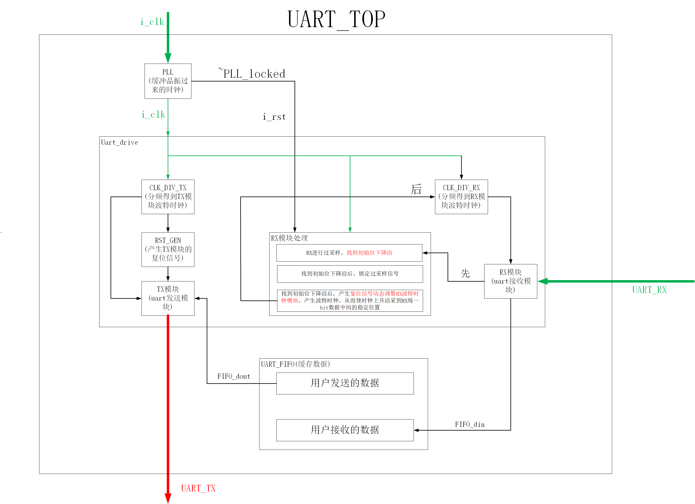
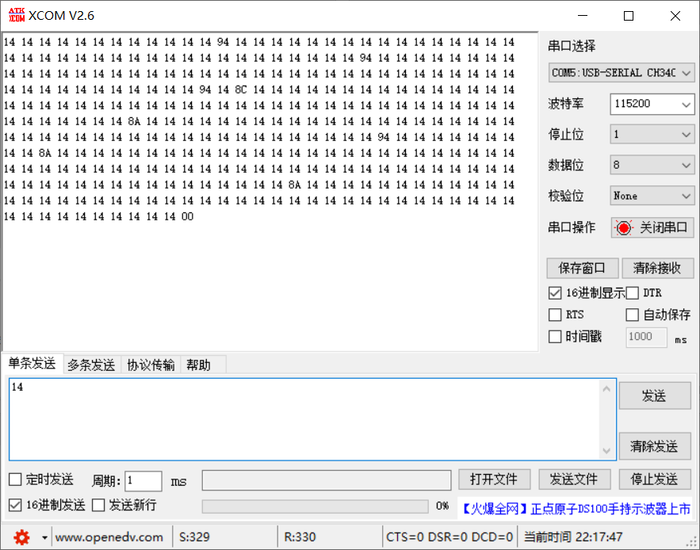
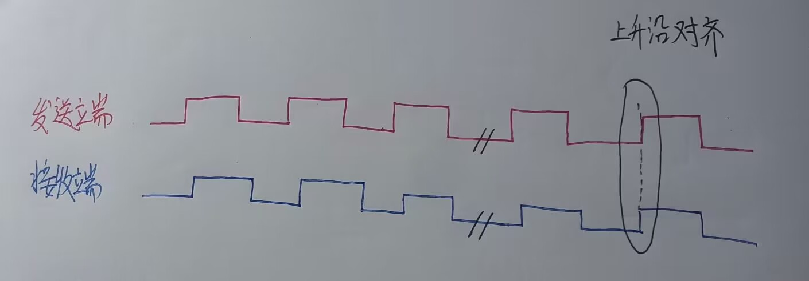
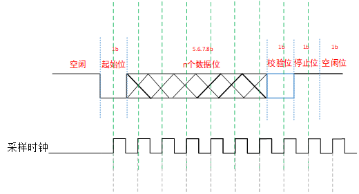
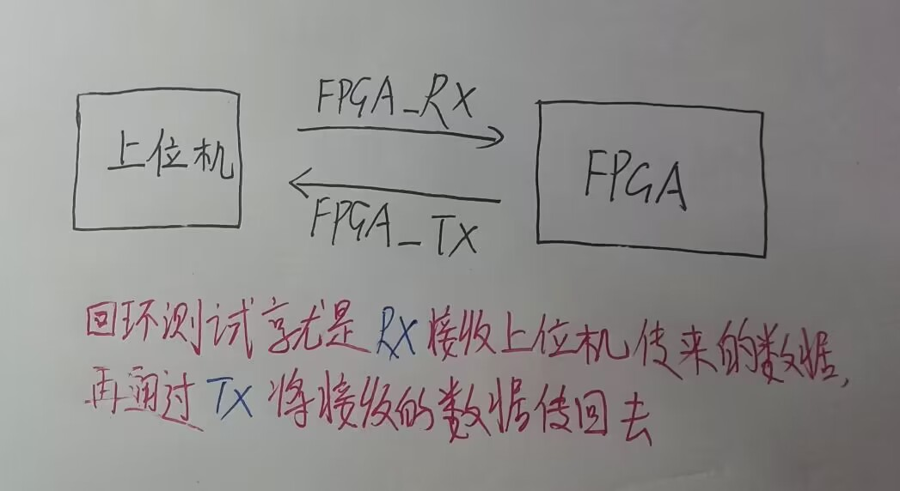
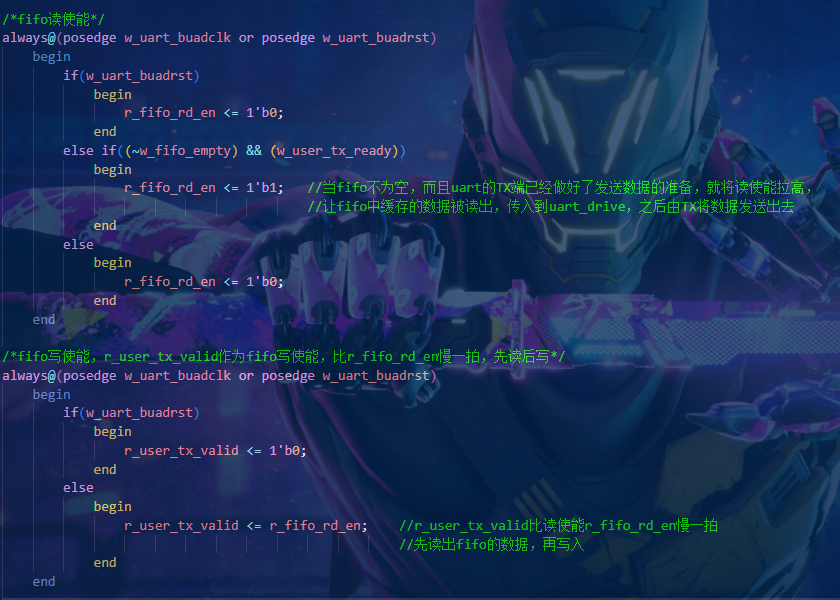
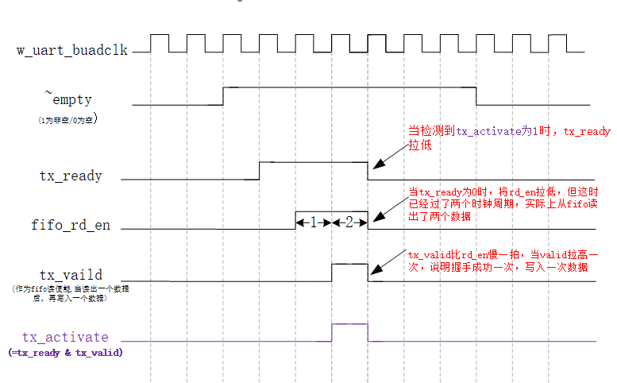
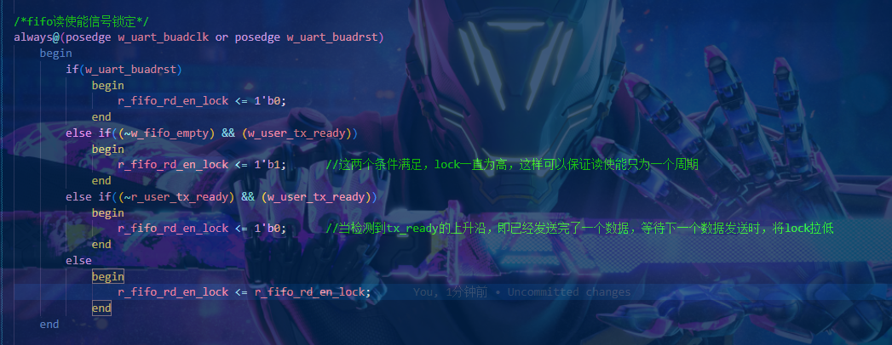

# UART课程笔记

## 1. 串口通信的类型

### (1). 异步串口通信（UART）

异步：通信中的发送端与接收端时钟不一致
异步串口通信：发送端和接收端使用自身的时钟，只需要两根线:RX与TX

uart的速度最高2Mbps(每秒传2M个bit)，速度很慢

应用在传输速度慢、数据量低的传输上，比如配置FPGA内部参数(存储的ID等)、与单片机之间传输少量的数据(比如单片机采集了温度传给FPGA)

*****

### (2). 同步串口通信（USART）
同步：通信中的发送端与接收端的时钟统一
同步串口通信。发送端和接收端使用统一的时钟，需要三根线：RX、TX、CLK

*****

## 2. 全双工、单工、半双工

关于全双工、半双工、单工

- 全双工：可同时收发数据：通常两个通道一个RX,一个TX，发送和接收互不干扰，比如UART、SPI

- 半双工：也有两个通道：TX和RX。数据不能同时收发，比如RS485、232、422，I2C

- 单工：只有一个方向，一个发送通道或者一个接收通道

*****

## 3.UART协议介绍

协议如图所示：

协议细节：

- 波特率：每秒传输的bit个数。单位bit/s、bps(bit per second)。一秒传输9600bit，波特率：9600bit/s 9600bps。bit per sec等于时钟频率。9.6KHZ，一秒9600个时钟周期，如果时钟为50Mhz，用50,000,000/9600=5208就可以得到分频系数。***(分频系数不必要精确到小数，因为在低速传输过程中，对这种细微的时钟偏差容忍度比较高)***
- 空闲状态：代表数据线上没有数据传输，空闲为高。
- 起始位：拉低总线代表马上要开始传输数据
- 数据位：代表传输的数据位数，可以传入任意bit数据，常规是8bit
- 校验位：无校验、奇校验、偶校验 (假设发送8bit数据)，
  ***对一个数据使用异或 ^ 相当于对这个数据进行奇校验，如果为1，则奇校验通过；否则偶校验通过***
  - 奇校验：假设发送的数据为8'b0000_0001，则校验位为0；假设发送的数据为8'b0000_0011，则校验位为1
    奇校验就是使8bit数据和那1位校验合在一起，**1**的个数为奇数个，则代表奇校验通过；否则不通过
    奇校验结果为1，则校验位为0；奇校验结果为0，则校验位为1，有个取反的过程
  - 偶校验：假设发送的数据为8'b0000_0001，则校验位为1；假设发送的数据为8'b0000_0011，则校验位为0
    偶校验就是使8bit数据和那1位校验合在一起，**1**的个数为偶数个，则代表偶校验通过；否则不通过
    偶校验结果为0，则校验位为0；偶校验结果为1，则校验位为1
  - 无校验：串口软件不检测校验位
- 停止位：拉高代表当前通信停止
- 空闲位：总线重回空闲状态
- UART先发送数据低位，再发送数据高位

协议控制方法：

- 采用状态机，在不同控制阶段进行跳转
- 计数器来计数控制阶段

***

## 4.UART设计要求

为了满足可移植性和方便性，设计要求如下：

- 波特率可配置
- 输入时钟可配置
- 数据位可配置
- 停止位可配置

*****

## 5.设计存在的误差

### (1).误码

在回传数据“14”的时候会发现数据里面出现了“94”，“8C”出现了数据误码的现象，尽量要把误码率弄到万分之一

#### a.误码的原因

接收端和发送端的时钟是异步的，而非同步的，他们的频率、相位不完全一样，之间存在着误差。

由于发送端和接收端的时钟不完全相同，在经过若干个时钟周期后，发送端和接收端的时钟的上升沿发生重合(产生***累计误差***)；而对于要发送的数据来说，在发送端的上升沿触发时，发送的数据开始产生了变化，可能从0→1，或者1→0，数据不稳定，出现亚稳态的情况。这时接收端正好上升沿对齐，从而采集到了亚稳态的数据，从而产生了误码的情况。

*****

#### b.误码校正

串口理想的采样状态：每次上升沿都位于uart线上数据的中心位置，这时候的数据最稳定。

 

为了实现每次采样时钟沿到来的时候都能采到数据的中心点，就要对时钟进行动态校正 。对于FPGA而言接收上位机给的数据是通过RX模块，而误码的产生往往是RX模块接收数据的时候产生的。

所以要用***过采样***的方法，即对RX模块的起始位的下降沿用更高频率的时钟进行采样，然后取得下降沿，作为采样时钟的起点，然后开启采样时钟，将数据中心的点采样下来。所以说就是根据起始位的下降沿确定uart数据采样时钟的开始，进而达到一个RX端动态采样时钟的调整。

****

### (2).fifo读出bug

#### a.fifo读出bug原因

源代码展示：

通过波形详解fifo的读bug

****

#### b.读出bug解决措施

添加信号锁定，通过把握ready和rd_en将读使能说定在一个周期内

