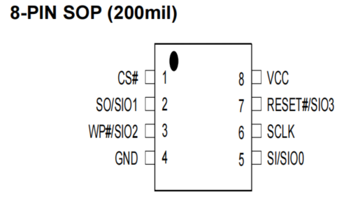
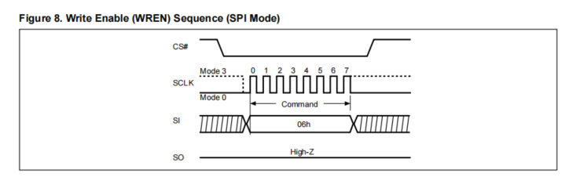
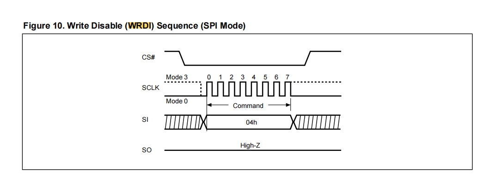
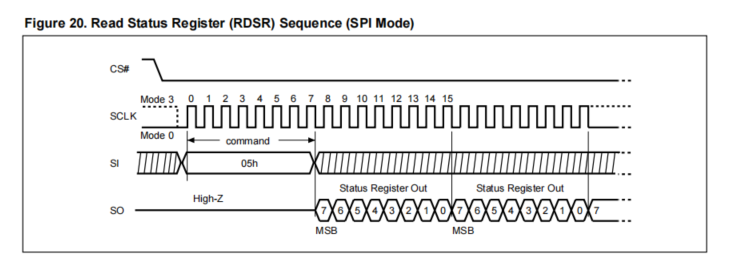
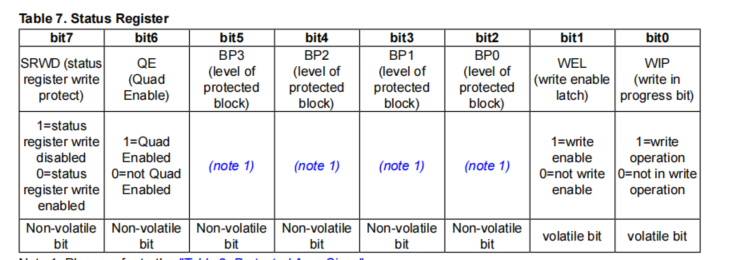
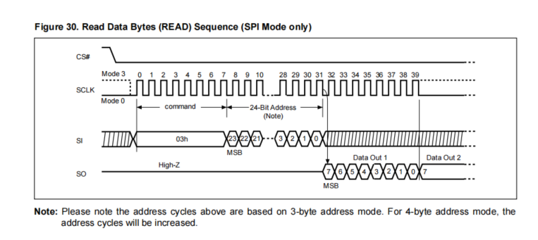
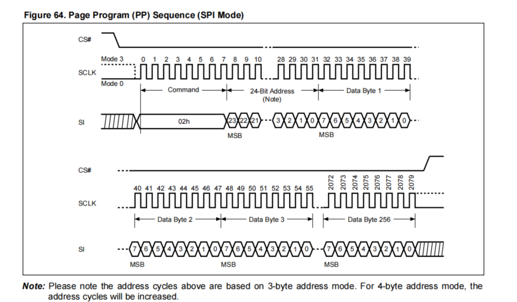
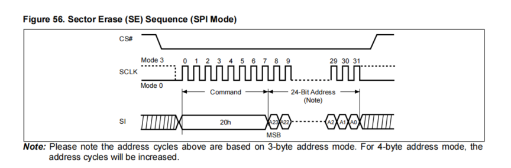
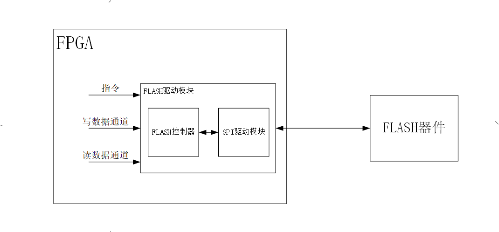
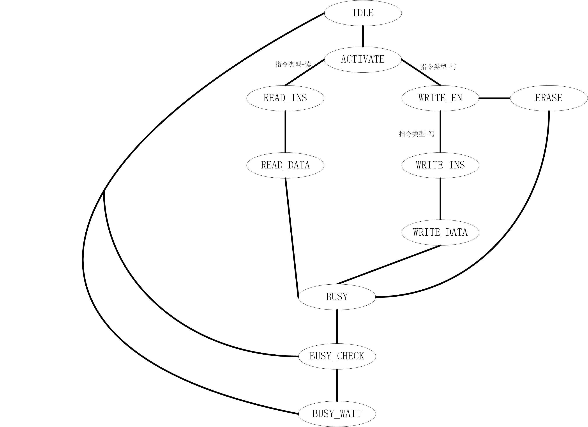

# FLASH课程笔记

该md基于kintex7-325t那块开发板的flash：**MX25L25645G**来写的，支持SPI的mode0和mode3

## 1.FLASH基本介绍

FLASH 存储器又称闪存，是一种长寿命的非易失性（在断电情况下仍能保持所存储的数据信息）存储器，一般用来保存一些重要的设置信息或者程序等等。通常采用 **SPI 协议**跟 FLASH 芯片进行数据交互。

FLASH分为NAND FLASH 和 NOR FLASH

[Flash存储器_百度百科 (baidu.com)](https://baike.baidu.com/item/Flash存储器/1254787)

****

## 2.FLASH功能

- 读状态寄存器
- 写状态寄存器
- 写使能指令
- 写失能指令
- 读数据
- 页编程：相当于一次性写256bytes的数据
- 扇区擦除
- 32KB块擦除
- 64KB块擦除
- 全片擦除
- 读厂商ID
- 复位

****

## 3.**MX25L25645G**基本配置

### (1).容量配置

- 总容量为256Mb bits换算之后为33,554,432bytes(1byte=8bit)
- 一页容量是256bytes，总共是131,072页
- 一个扇区容量是4KB(4096bytes)，也成为4KB块，总共是16页，所以整个flash可以分成2048个扇区，即2048个4KB块
- 32KB块容量是8个扇区=128页，所以整个flash可以分成1024个32KB块
- 64KB块容量是16个扇区=256页，所以整个flash可以分成512个64KB块

***

### (2).引脚说明

该FLASH引脚如下图所示

a. 	CS#		       chip select	   片选信号引脚 **(带#为低电平有效)**

b.	SO/SIO1		SO       		  作为FLASH数据输出引脚，在***SPI***协议中相当于MISO(master input slave output)的SO

​					  SIO1 	             用于2xI/O或4xI/O读取模式使用

c.	WP#/SIO2	     WP#     		 Write Protection ，写保护，低电平时不能被写入数据 **(带#为低电平有效)**

​					   SIO2     	        用于4xI/O读取模式使用	

d.	GND:				        	   地引脚

e.	VCC:				          	   电源引脚

f.	 RESET#/SIO3：     RESET#  	      FLASH低电平复位 **(带#为低电平有效)** 
   					 SIO3     	        用于4xI/O读取模式使用

g.	SI/SIO0:                   SI       		   作为FLASH数据输入引脚，在***SPI***协议中相当于MOSI(master output slave input)的SI
  				 	 SIO0     		用于2xI/O或4xI/ O读取模式

h.	SCLK:						    作为输入FLASH的SPI时钟，最高可支持***133MHz***

******

### (4).FLASH的一些常用指令

**h代表hex，16进制**

#### a.写使能  (WREN，write enable)：06h

写使能的SPI时序图如下：

当FLASH的片选信号拉低之后，由主机向从机(FLASH)，在SPI模式下通过MOSI发送06h，使得FLASH进入写入模式

#### b.写失能  (WRDI，write disable)：04h

写失能的SPI时序图如下：

当FLASH的片选信号拉低之后，由主机向从机(FLASH)，在SPI模式下通过MOSI发送04h，使得FLASH不再写入数据

#### c.读状态寄存器  (RDSR，read status register)：05h

读状态寄存器的SPI时序图如下：

当FLASH的片选信号拉低之后，由主机向从机(FLASH)，在SPI模式下通过MOSI发送05h，FLASH接收完05h(读状态寄存器指令)，数据通过MISO输出状态的数据，每一次数据为1byte(8bit)，先读出的是数据的高位MSB。读取状态寄存器可以在任何时候被读取（甚至在程序/擦除/写入状态寄存器条件下）

状态寄存器低8位的配置如下

每一位的含义：

- **(主要)bit0** (WIP，Write in Progress，正在写入中)：相当于busy，当WIP位设置为1时，表示FLASH在程序/删除/写状态寄存器进程中繁忙。
- **(主要)bit1** (WEL，Write Enable Latch，写使能锁存)：WEL需要设置为“1”后，FLASH才能接受程序和擦除指令
- **bit2——bit5** (Block Protect，块保护)：这些位定义了内存的保护区域（针对页面程序（PP）、扇区删除（SE）、块清除3232KB（BE32K）、块清除（BE）和芯片删除（CE）指令（仅当块保护位（BP3：BP0）设置为0时，才能执行CE指令）。BP3、BP2、BP1、BP0位的默认值为“0”。这是没有保护的。
- **bit6** (Quad Enable，四线使能)：当QE为“0”时，忽略四线指令；引脚WP#/SIO2，重置#/SIO3和NC/SIO3分别作为WP#、重置#和NC。当QE为“1”时，启用四线模式，支持四线模式命令以及单模式和双模式命令。引脚WP#/SIO2，重置#/SIO3和NC/SIO3功能分别作为SIO2和SIO3，并且它们的备用引脚功能被禁用。启用四轴模式还会禁用HPM和重置功能。
- **bit7** (Status Register Write Disable，状态寄存器写入失能)：硬件保护模式要求SRWD设置为1，WP#/SIO2引脚信号为低级。在硬件保护模式下，写状态寄存器（WRSR）指令不再被接受执行，SRWD位和块保护位（BP3、BP2、BP1、BP0）为只读。SRWD位的默认值为“0”。

#### d.读数据  (READ，normal read)：03h

读数据的SPI数据图如下：

当FLASH片选信号拉低之后，由主机向从机(FLASH)，在SPI模式下通过MOSI发送03h，FLASH接收完03h(读数据指令)，之后在输入3bytes(24 bits)的地址之后，FLASH通过MISO发出被读取的数据，一个数据位1byte(8 bit)，先读出数据的高位MSB

对于24bit地址：addr[7:0]是字节地址，addr[15:8]是扇区地址，addr[23:16]是块地址

在每个字节数据被移出后，该地址会自动增加到下一个更高的地址，因此可以在一条read指令中读取整个内存。当到达最高地址时，地址计数器将转到0。就比如说我从0位置开始读，读到255位置的时候，下一时刻位置就回到了0位置重新读。

#### e.页编程  (PP，page program)：02h

页编程的SPI时序图如下：

页编程（PP）指令用于将FLASH的数据位变为“0” (默认是1)。1到256字节可以被发送到FLASH。在页编程（PP）之前，必须拉高写使能（WREN）指令来设置写入启用锁存器（WEL）位。

如果向FLASH发送了超过256个数据字节，则只接受后256个数据字节，而忽略以前的数据字节。

页编程指令要求所有的数据字节都在同一个256字节的页面内。低顺序地址字节A[7：0]指定了所选页面中的起始地址。FLASH可以接受（256-A）数据字节，如果要编程256个数据字节，则A[7：0]应设置为0。

默认的读取模式为3字节地址

当FLASH片选信号拉低之后，由主机向从机(FLASH)，在SPI模式下通过MOSI发送02h，FLASH接收完02h(页编程指令)，之后在输入3bytes(24 bits)的地址之后，至少输入一个字节的数据，通过MOSI输入，先输入数据的高位

#### f.扇区(4KB块)擦除  (SE，sector erase)：20h

扇区擦除的SPI时序图如下：

***在执行擦除命令之前一定要写发送写使能命令***。扇区擦除（SE）指令用于将所选扇区的数据擦除,全变为“1”。该指令用于任何4KB的扇区。在发送扇区擦除（SE）之前，必须执行写入启用（WREN）指令来设置写入启用锁存器（WEL）位。

当FLASH片选信号拉低之后，由主机向从机(FLASH)，在SPI模式下通过MOSI发送20h，FLASH接收完20h(扇区擦除指令)，之后再通过MOSI输入3bytes(24 bits)的地址之后，将所选择的对应扇区数据内容擦除为1

#### g.读厂商ID

的SPI时序图如下：

当FLASH片选信号拉低之后，由主机向从机(FLASH)，在SPI模式下通过MOSI发送9Fh，FLASH接收完9Fh(读厂商ID指令)之后，FLASH通过MISO向主机发送的第一个字节是制造商ID，第二个字节是设备ID。

#### h.其他

- 32KB块擦除  (BE 32K，block erase 32KB)：52h
- 64KB块擦除  (BE，block erase 64KB)：D8h
- 整个芯片擦除  (CE，chip erase)：60h or C7h
- 使能复位  (RSTEN，reset enable)：66h
- 整体复位  (RST，reset memory)：99h
- 读厂商ID  (RDID，read identification)：9Fh

******

## 4.FPGA控制FLASH

### (1)控制架构

### (2)控制状态

