# IIC课程笔记

## 1.IIC简介

IIC总线概念：IIC(Inter Integrated Circuit，集成电路总线)一种两线式串行总线，用于连接微控制器及其外围设备。它是由数据线 SDA (Serial DATA)和时钟 SCL(Serial CLK) 构成的串行总线，可发送和接收数据。 

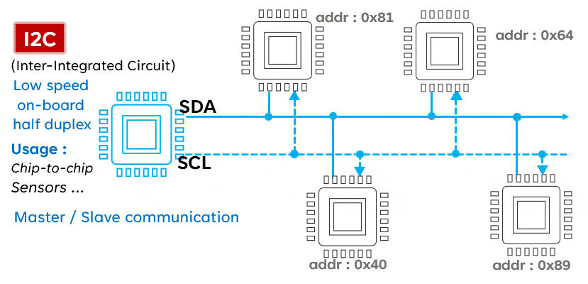

IIC特点：

- 同步通信，有时钟线，不同于uart无时钟线，为异步通信
- 有应答机制 （spi是无应答的）
- 半双工
- 支持多住多从
- 传输速度
  - 标准模式：100kbps (100kbit/s)
  - 快速模式：400kbps
  - 高速模式：3.4Mbps

***

## 2.IIC传输协议

### (1)IIC的开始与结束

初始空闲时SDA和SCL为高电平**(高电平有个好处，可以检测设备好坏)**，结束状态的时候重新拉高

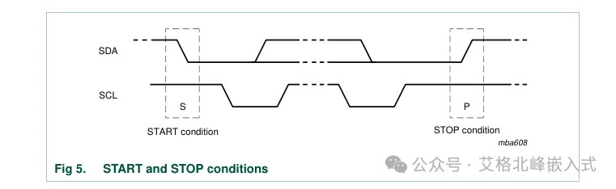

START和STOP触发信号由主设备FPGA产生

***

### (2)IIC数据有效

SDA线上的数据必须在时钟HIGH期间保持稳定。只有当SCL线上的时钟信号为LOW时，数据线的HIGH或LOW状态才能改变。传输的每个数据位都会产生一个时钟。

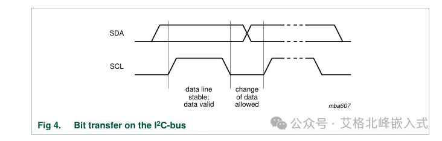

***

### (3)IIC传输字节方式

每一个放在SDA线上的字节必须是8位宽。每次传输可以传输的字节数是没有限制的。每一个字节后面必须跟一个应答位(ACK)。数据先传输最高位(MSB)。如果一个从机在执行其他一些功能之前不能接收或传输另一个完整的字节数据，

例如处理一个内部中断，它可以保持时钟线SCL为LOW，迫使主机进入等待状态。当从机准备好接收另一个字节数据并释放时钟线SCL时，数据传输继续进行。

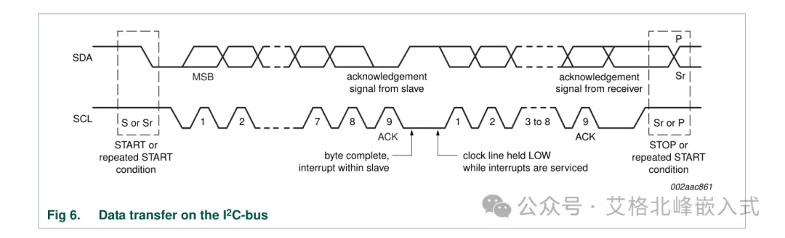

***

### (4)IIC应答

应答（ACK）是指：在传输完每个字节（进行了8个SCL）后的下一个SCL时钟周期（第9个SCL），由数据接收端向数据发送端返回一个LOW信号表示本次发送的字节被成功接收了。

如果在第九个SCL时，SDA为HIGH，这表示本次发送的这一字节数据是没有被数据接收端应答或者接受的（未应答，NACK）。这时就需要主设备对当前传输进行中断或者重新开始新的一条传输。

设备未应答的原因：

1. 在总线上传输地址，所以没有设备响应确认。
2. 接收器无法接收或发送，因为它正在执行一些实时功能，并且还没有准备好与主机进行通信。
3. 在传输过程中，接收方收到了它无法理解的数据或命令。
4. 在传输过程中，接收方不能接收到任何更多的数据字节。
5. 主接收机必须向从发送机发出传输结束的信号。

****

## 3.EEPROM芯片介绍

以kintex7开发板上的EEPROM芯片——BL24C02，上海贝岭

****

### (1).EEPROM基本信息

- 容量大小

  总大小：4K bit = 4096bits = 512 byte

  一页是 16 byte，总共32页

- 支持传输速率：1MHz

****

### (2).EEPROM内部结构

EEPROM内部结构如图所示：

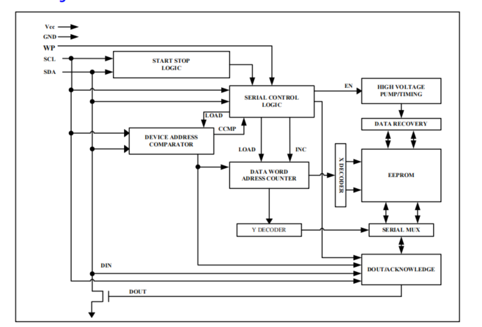

结构解析：

- START STOP LOGIC:与IIC总线相互连接的的开始结束逻辑
- DEVICE ADDRESS COMPARATOR:EEPROM的器件地址比较器，通过IIC传输过来的地址信息与比较器比较，如果相同则进行后续的操作，如果地址对不上就无法进行后续的操作。
- DATA WORD ADRESS COUNTER:数据地址计数器，写一次数据地址+1
- DOUT/ACKNOWLEDGE:EEPROM的数据输出/应答输出

****

### (3)EEPROM传输

#### a.地址传输

器件地址如下：

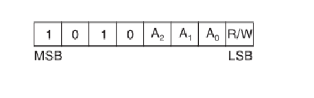

其中A2,A1,A0跟PCB板子上EEPROM的引脚连接的VCC或者GND有关

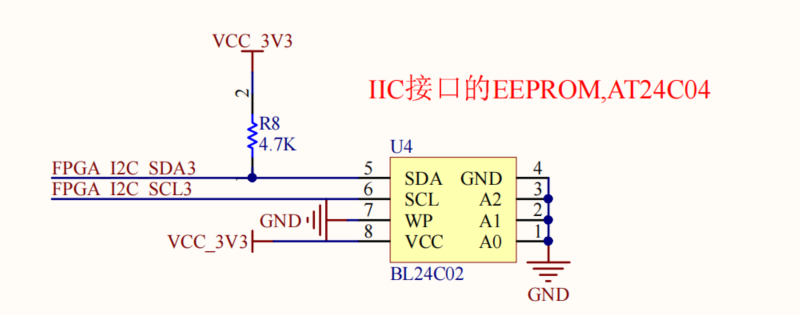

其中R/W为读写位，1为读操作/0为写操作

****

#### b.写数据操作

写数据分为***字节写***和***页写***

- 字节写数据

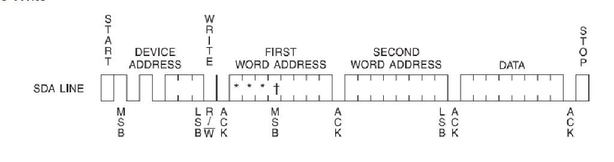

主设备发送完设备地址(7 bit)和写命令0(1 bit)，之后等待从机响应ACK 0，则表示确认了设备地址确认成功

之后先发送第一个字地址（字地址就理解成数据对应的地址，两个字地址就代表更多的地址），ACK 0响应之后，再发送第二个字地址，ACK 0响应之后，发送一个字节数据，ACK 0响应之后，主机拉高SDA表示该次写数据结束。

- 页写数据

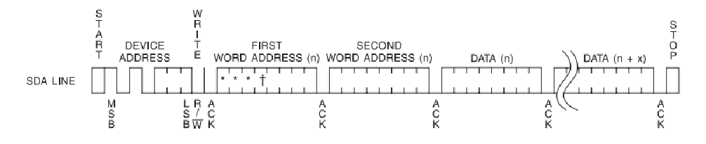

页写数据前半段跟字节写差不多，只不过传输完第一个数据字节之后，主机不拉高SDA表示写数据结束，而是继续写，

对于kintex7上面的EEPROM来说，一次页写最多可以写入16个字节数据，即一页；每次写在地址内部+1

如果一次页写的数据超过16个字节，则第17个字节回到这次传输的初始位置，覆盖掉第1个字节数据

****

#### c.读数据操作

读操作分为***普通读***和***随机读***和***顺序读***

- 普通读

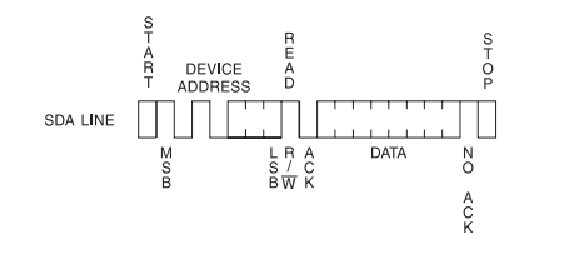

主设备发送完设备地址(7 bit)和读命令1(1 bit)，之后等待从机响应ACK 0，则表示确认了设备地址确认成功

这次被读出的数据是之前写数据地址计数器在的最后一个位置，或者在其他方式读数据地址计数器在的最后一个位置

当要结束普通读的时候，主机在读出的字节后，发送NO ACK，即1，表示此次读操作结束

- 随机读

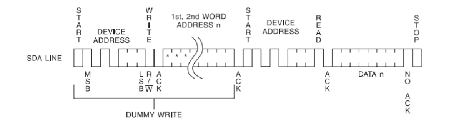

随机读操作实现进行一个 “虚拟写”操作，先发送器件地址、写命令0、字地址，收到ACK 0响应之后，拉高一下SDA

再发送一次器件地址和读命令1，ACK 0响应之后，返回读的数据，读出一字节的数据，就由主机发送一个ACK，即1，表示该字节读数据成功，

若不想再继续读了，则主机在读完一个字节数据后，拉高ACK，表示此次读数据操作结束。

虚拟写的作用是将内部地址指针指到对应的地址，然后从这个地址开始读数据。

- 顺序读

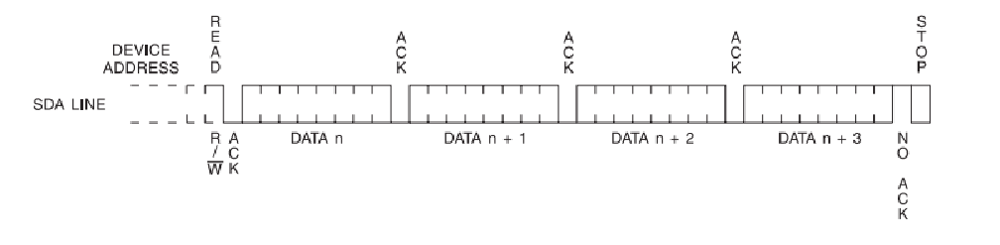

顺序读相比于随机读，没有 “虚拟写” 这个操作，就是发送完器件地址之后，在上一次读写操作的位置，继续读数据，每次读完一个字节数据，内部数据地址自+1，如果读到当前页的极限，下一次返回就从第一个位置开始读取。

每读出一个数据，就由主机给一个ACK 0 的响应，直到读到最后一个字节数据，给出 NO ACK 1，表示此次顺序读操作结束。

读写操作的异同：

- 相同：
  - 每次读写操作，发送器件地址，返回的ACK是由***从机***产生的
  - 每次读写操作，内部操作地址自+1
- 不同：
  - 写操作，写一字节数据，ACK是由***从机***产生的；
    读操作，读一字节数据，ACK是由***主机***产生的
  - 写操作，写到当前页最后一个字节时，下一个字节是回到当前页第一个字节，并覆盖第一个字节；
    读操作，地址滚动是指，一直读，直到读到该EEPROM最后一个地址，下一个读出的数据回到，该芯片的第一个地址位置

*****

## 4.EEPROM读写

EEPROM读写状态如下：

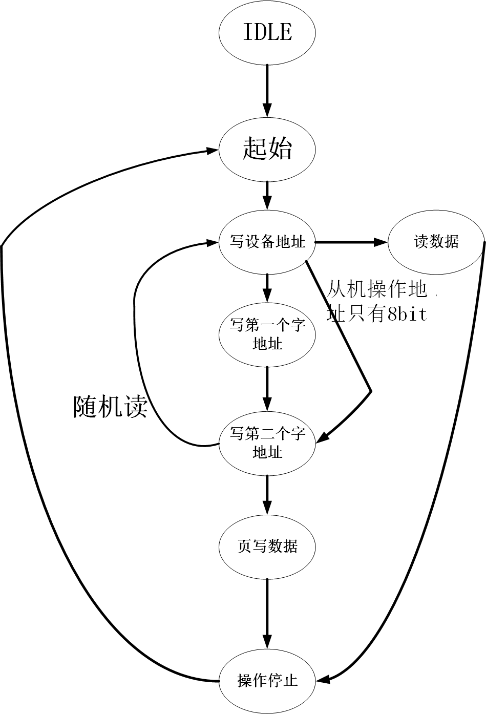
